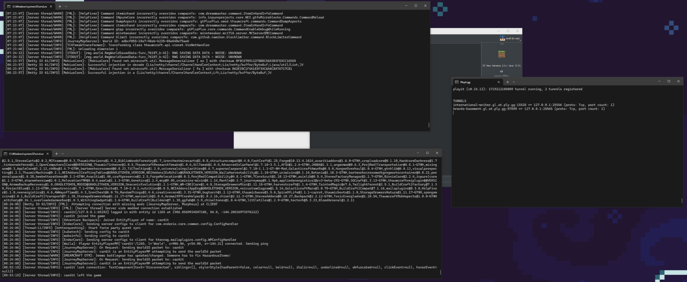

# Projektdefinition Persönliche Website

Ich hatte die Idee, eine Website zu machen, welche mir helfen würde, die Game-Server, welche ich zu Hause hoste, übersichtlicher zu hosten und den Prozess zu automatisieren. Gleichzeitig ermöglicht mir eine Website, Daten über die Server schön darzustellen und das ganze online für meine Kollegen freizustellen.

### Elemente meiner Seite

1. **Server-Übersicht**
- Homepage, welche insgesamt Spieler und Server anzeigt
- Listenansicht von allen Servern mit RAM-Verwendung und Spieleranzahl.

2. **Server Detailansicht**
- Eine Page Detailansicht eines einzelnen Servers, in welcher alle Daten angezeigt werden.
- Eine Page Console, in welcher man die Serverkonsole ansehen und bedienen kann.

3. **Login Page**
- Sign-up-Formular.
- Log-in-Formular.
- Passwort vergessen Formular.

Das Ziel ist es, mein aktuelles Setup zu ersetzen.

